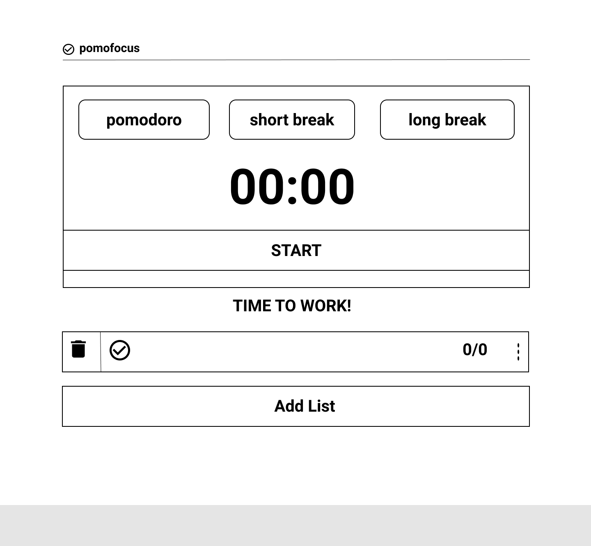
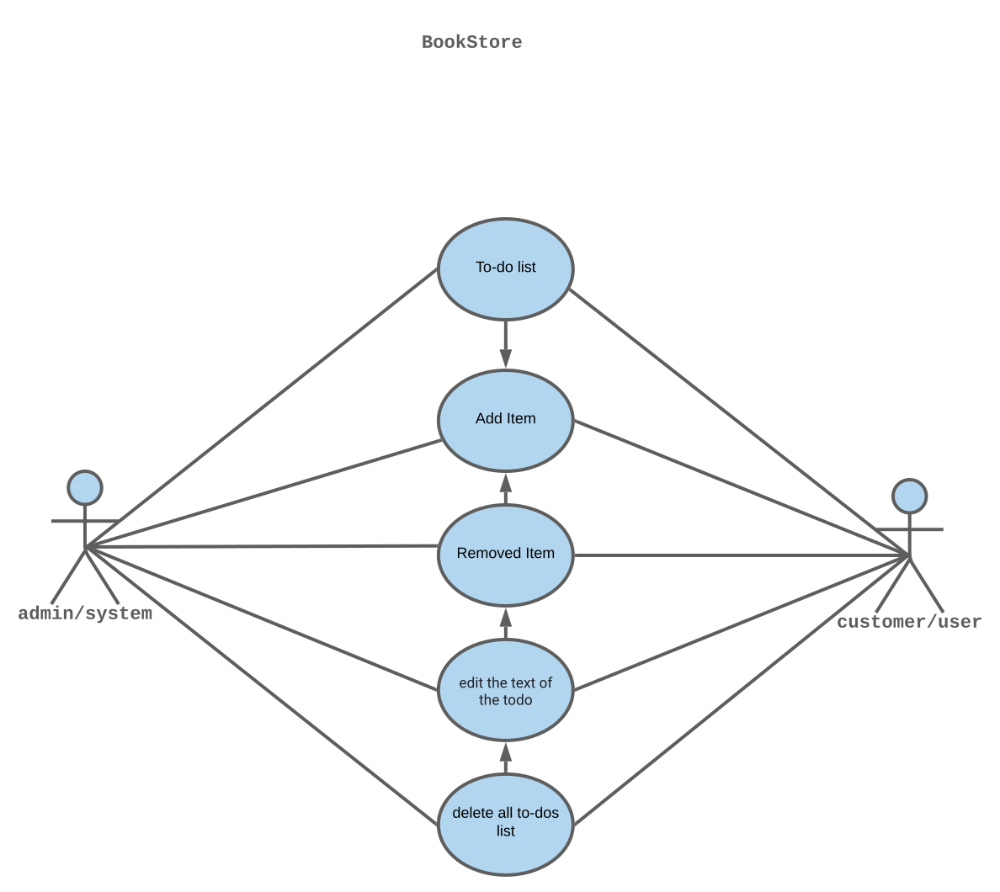

# Reverse-Engineer pomofocus.io

This is a javascript project to build a customizable pomodoro timer.
This project has been developed using the _development strategy_ concept with one branch per step.
It is a way to practice the concept of asynchronous Programming in javascript.

## The contents

- [General info](#general-info)
- [Project image](#project-image)
- [User image](#user-flow)
- [Technical equipment](#technical-equipment)
- [Setup](#setup)
- [Features](#features)
- [Inspiration](#inspiration)

## General info

- This project is a simple way to practice asynchronous Programming in using `github` to push your work when your collebrating with others IT's, `html`, `css` and `javascript`.
- The purpose of using this keyword is be familiar with asynchronous Programming via using classes and functions like `SetTimeout` and `SetInterval` .

> This project use this [template](https://github.com/HackYourFutureBelgium/classes-starter)

## Project image

---

## User Flow

---

## Technical equipment

- HTML5
- CSS3
- Javascript
- Github

## Setup

There are several ways to run this run this project. one of them is to install Live Server extension in VS Code.

## Features

List of features :

- Responsive design that works with desktop and mobile
- Applying Incremental Development
- Encapsulation
- Color transition to switch moods between work time and rest time
- Audio notification at the end of a timer period

To-do list:

- Add a color transition to switch moods between work time and rest time, to admire the users
- Add functionality to Customize timer intervals to suit client preference
- Improve the performance

## Inspiration

Project inspired by pomofocus.io
